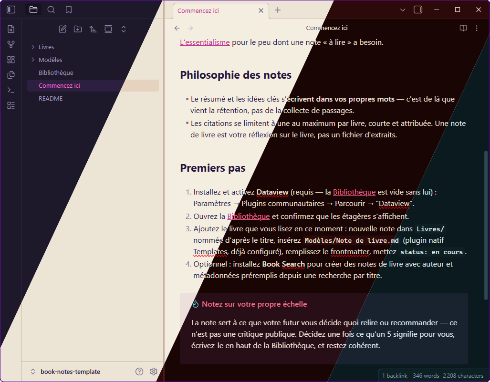

# Foreglow Theme for Obsidian

A twilight-inspired theme for Obsidian with four looks in one package:
**Foreglow** (dark, dawn), **Afterglow** (light, dusk), **Alpenglow**
(rubescent), and **Airglow** (auroral).

This is a single Obsidian theme (one `manifest.json` + `theme.css` at the
repo root) that handles all four color variants in one package:

- **Foreglow** (dark) and **Afterglow** (light) follow Obsidian's own
  Appearance → Base color scheme toggle automatically — no extra setup.
- **Alpenglow** and **Airglow** are alternate dark flavors, selectable via
  the [Style Settings](https://github.com/mgmeyers/obsidian-style-settings)
  community plugin (installed separately). Once installed, go to
  Settings → Style Settings → Foreglow → "Alternate dark flavor" to switch.

This one-theme approach is also what makes the theme eligible for
Obsidian's official Community Themes directory in the first place —
submissions there are one GitHub repo per theme, with `manifest.json` and
`theme.css` at the repo root (see [Publishing](#publishing) below); there's
no way to register four separately-named themes from one repo.

## Repository Layout

```
.
├── manifest.json
├── theme.css
└── foreglow-pack-obsidian-alt.png   # marketplace screenshot
```

## Installation

### Manual

1. Open Obsidian Settings → Appearance → Themes → click "Manage" (or the
   folder icon) to open your vault's theme folder — this is
   `<vault>/.obsidian/themes/`
2. Create a folder there named `Foreglow` and copy `manifest.json` and
   `theme.css` from this repo into it
3. Restart Obsidian or reload it (`Ctrl/Cmd+R`)
4. Back in Settings → Appearance → Themes, select **Foreglow**

### From the Community Themes directory

Once published (see [Publishing](#publishing)), search for **Foreglow** in
Settings → Appearance → Themes → "Manage" → browse.

### Reaching Alpenglow and Airglow

Install the [Style Settings](https://obsidian.md/plugins?id=obsidian-style-settings)
community plugin, then go to Settings → Style Settings → Foreglow →
"Alternate dark flavor" and pick **Alpenglow** or **Airglow**. Leave it
unset to use the default Foreglow/Afterglow pair.

## Publishing

Obsidian's [Community Themes](https://docs.obsidian.md/Themes/App+themes/Submit+your+theme)
directory requires, at the repo root:

- `manifest.json` and `theme.css` (already here)
- `README.md` and `LICENSE` (already here)
- A screenshot (512×288px recommended) — have one, see
  [Screenshot](#screenshot) below (not resized to the recommended
  dimensions yet)
- A GitHub Release whose tag matches `manifest.json`'s `version`
  (semantic versioning), with `manifest.json` and `theme.css` attached to
  the release as binary files

Once those are in place, submit through
[community.obsidian.md](https://community.obsidian.md) with your GitHub
account linked.

## Color Palette

### Foreglow (Dark)

| Token | Hex | Usage |
|-------|-----|-------|
| Background | `#161221` | Main background |
| Current Line | `#281F3D` | Line highlight |
| Selection | `#3D2556` | Text selection |
| Foreground | `#E8E3F2` | Default text |
| Comment | `#736699` | Comments |
| Keyword | `#CB81E4` | Keywords |
| String | `#ED9F82` | Strings |
| Function | `#EC93BF` | Functions |
| Number | `#EFBF6C` | Numbers |
| Type | `#75C6D7` | Classes, types |
| Variable | `#C7BCE6` | Variables |
| Accent | `#F471C8` | Cursor, accent |

### Afterglow (Light)

| Token | Hex | Usage |
|-------|-----|-------|
| Background | `#F4EEE1` | Main background |
| Current Line | `#E6D6C1` | Line highlight |
| Selection | `#DFC2AA` | Text selection |
| Foreground | `#24163B` | Default text |
| Comment | `#7A6F9B` | Comments |
| Keyword | `#8930A6` | Keywords |
| String | `#B64820` | Strings |
| Function | `#AE296B` | Functions |
| Number | `#955F0F` | Numbers |
| Type | `#1D7187` | Classes, types |
| Variable | `#4D3781` | Variables |
| Accent | `#C3228E` | Cursor, accent |

### Alpenglow (Rubescent)

| Token | Hex | Usage |
|-------|-----|-------|
| Background | `#1A0505` | Main background |
| Current Line | `#3D1212` | Line highlight |
| Selection | `#5A1E1E` | Text selection |
| Foreground | `#F5E6DC` | Default text |
| Comment | `#8B6B6B` | Comments |
| Keyword | `#FF6B8A` | Keywords |
| String | `#FF9F6C` | Strings |
| Function | `#FFB3C6` | Functions |
| Number | `#FF7E67` | Numbers |
| Type | `#E85D75` | Classes, types |
| Variable | `#FFA07A` | Variables |
| Accent | `#FF6B9D` | Cursor, accent |

### Airglow (Auroral)

| Token | Hex | Usage |
|-------|-----|-------|
| Background | `#0A1A1F` | Main background |
| Current Line | `#0F2024` | Line highlight |
| Selection | `#162E34` | Text selection |
| Foreground | `#E0F0F5` | Default text |
| Comment | `#5A8A90` | Comments |
| Keyword | `#2EE8C8` | Keywords |
| String | `#7DD8A8` | Strings |
| Function | `#C8A0E8` | Functions |
| Number | `#D4B870` | Numbers |
| Type | `#4AA8D0` | Classes, types |
| Variable | `#8BC4D4` | Variables |
| Accent | `#2EE8C8` | Cursor, accent |

## Screenshot



## License

MIT © [Foreglow](https://github.com/Foreglow)
